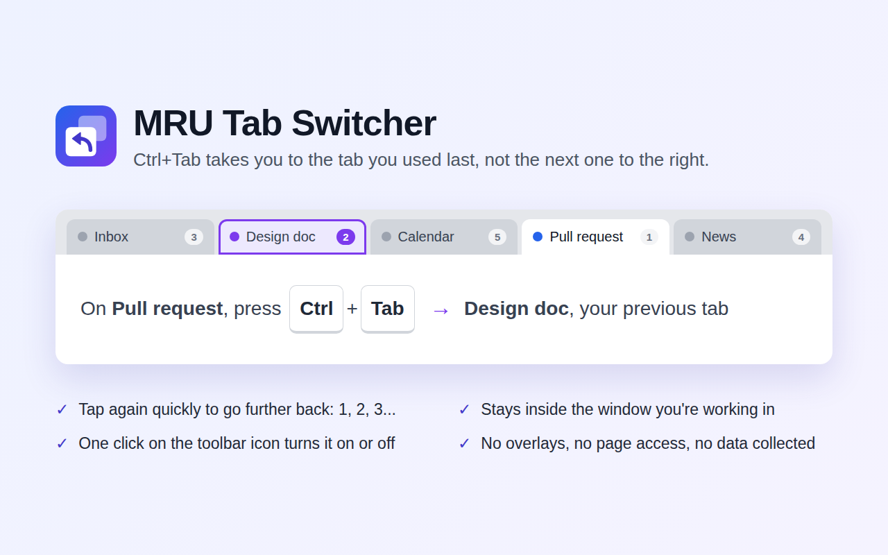

# MRU Tab Switcher


**Ctrl+Tab takes you to the tab you used last, not the next one to the right**, the way Brave and Firefox can. Tap it again quickly to go further back through your recent tabs.

It works in the background with nothing on screen: no overlays, no popups, no access to the pages you visit, and no data collected.

- **One tap** goes to the tab you were on before this one.
- **Quick repeated taps** (less than a second apart) go further back: 2nd most recent, 3rd, and so on, wrapping round to where you started. Tabs you only pass through don't count as "used".
- **Stays in your window.** Switching only cycles through the tabs of the window you're working in.
- **On/off with one click.** Click the toolbar icon to toggle it; the badge shows **ON** (green) or **OFF** (gray). While it's off and bound to Ctrl+Tab, Ctrl+Tab behaves like Chrome's normal "next tab".



## Install

### From the Chrome Web Store

Coming soon.

### From source

1. Download this repository: [main.zip](https://github.com/Hariprasad-b-s/mru-extension/archive/refs/heads/main.zip), then unzip it. Or `git clone https://github.com/Hariprasad-b-s/mru-extension.git`.
2. Keep the folder somewhere permanent. Chrome loads the extension from it every time.
3. Open `chrome://extensions` and turn on **Developer mode** (top right).
4. Click **Load unpacked** and pick the folder that contains `manifest.json`.
5. Pin it from the puzzle-piece menu so you can see its ON/OFF badge.

It works straight away with **Alt+Y**, or **Control+Y** on macOS. To use Ctrl+Tab instead, do the one-time setup below.

## Use Ctrl+Tab (one-time setup)

Chrome won't let an extension set Ctrl+Tab itself, and the Keyboard shortcuts page won't let you type Tab. The page's own developer API does accept it, so you set it from the DevTools console, the same way [QuicKey](https://fwextensions.github.io/QuicKey/ctrl-tab/) does.

1. Open `chrome://extensions/shortcuts`.
2. Open DevTools: **Ctrl+Shift+J** on Windows/Linux, **Cmd+Option+J** on macOS.
3. Paste the code below into the Console and press **Enter**. If Chrome asks, type `allow pasting` first, then paste again.

```js
(() => {
  const COMMAND = 'switch-to-previous-tab';
  const KEYBINDING = 'Ctrl+Tab';

  const api = chrome.developerPrivate;
  if (!api) {
    console.error('Run this on chrome://extensions/shortcuts, not on a regular page.');
    return;
  }

  // Find the extension by its command rather than its ID: a Chrome Web Store
  // install and an unpacked copy have different IDs. Only enabled ones count.
  api.getExtensionsInfo({}, (all) => {
    const matches = all.filter(
      (ext) => /MRU/i.test(ext.name) && ext.commands.some((c) => c.name === COMMAND),
    );
    if (matches.length === 0) {
      console.error('MRU Tab Switcher is not installed, or is turned off.');
      return;
    }
    if (matches.length > 1) {
      console.warn(
        `${matches.length} copies are installed; setting the first. Remove the ` +
          'extras on chrome://extensions, then run this again.',
      );
    }

    const { id } = matches[0];
    api.updateExtensionCommand({ extensionId: id, commandName: COMMAND, keybinding: KEYBINDING }, () => {
      // Chrome clears the old shortcut first and reports no error if the new
      // one is rejected, so read back what was actually stored.
      api.getExtensionInfo(id, ({ name, commands }) => {
        const { keybinding } = commands.find((c) => c.name === COMMAND);
        if (keybinding) {
          console.log(`${name}: shortcut is now ${keybinding}.`);
        } else {
          console.error(`Chrome rejected "${KEYBINDING}"; the shortcut is now unset.`);
        }
      });
    });
  });
})();
```

4. It should print `...: shortcut is now Ctrl+Tab.`, and the shortcuts page should show **Ctrl + Tab** (⌃⇥ on macOS) instead of Alt+Y.

The same code is in [`scripts/set-ctrl-tab-shortcut.js`](scripts/set-ctrl-tab-shortcut.js). It works for a Web Store install and a source install alike, and it's safe to run more than once. On macOS, "Ctrl" means the Control key here, so the code is the same on every platform.

To go back to a normal shortcut, set one on the shortcuts page as usual. While Ctrl+Tab is bound to this extension, Chrome's own Ctrl+Tab ("next tab") is replaced; use **Ctrl+PgDn** (Windows/Linux) or **Cmd+Option+→** (macOS) for that instead. Ctrl+Shift+Tab is unaffected.

## Updating a source install

Download the new files into the same folder (or `git pull`), then click the reload arrow on the extension's card in `chrome://extensions`. Your shortcut stays set.

If you installed a copy before the extension had a fixed ID, remove it and use **Load unpacked** again once. The Ctrl+Tab script tells you if more than one copy is installed.

## Privacy

The extension keeps the order you used your tabs in, as tab ID numbers in the browser's memory, and remembers whether it's switched on. It never reads page content, makes no network requests, and collects nothing. See [PRIVACY.md](PRIVACY.md).

## Publishing

`./scripts/package.sh` builds the zip to upload to the Chrome Web Store. The listing text, images and step-by-step instructions are in [store/listing.md](store/listing.md).

## Files

| Path | What it is |
| --- | --- |
| `manifest.json` | Extension manifest (Manifest V3) |
| `background.js` | Service worker: tab tracking, switching and the ON/OFF toggle |
| `icons/` | Extension icons, plus `icon.svg`, the source they're rendered from |
| `scripts/set-ctrl-tab-shortcut.js` | Ctrl+Tab setup code to paste into DevTools |
| `scripts/package.sh` | Builds `dist/mru-tab-switcher-<version>.zip` for the Web Store |
| `store/` | Web Store listing text and images |
